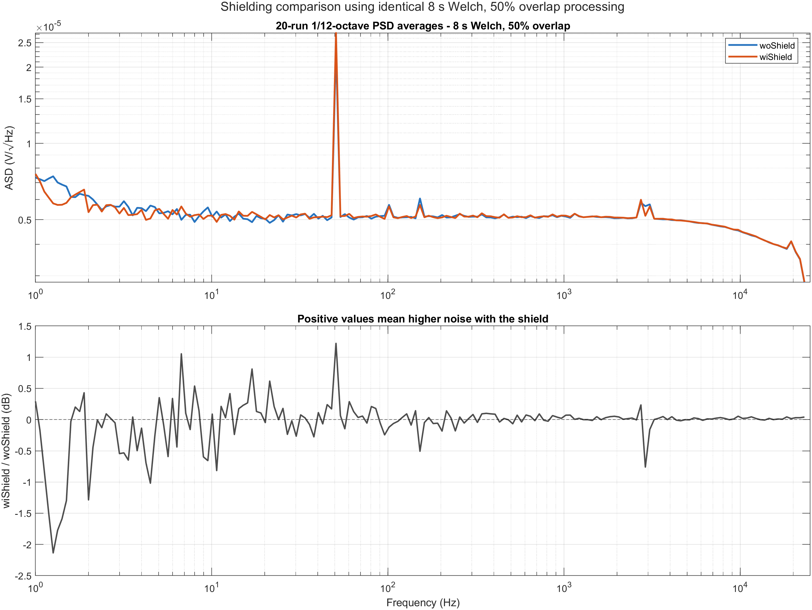
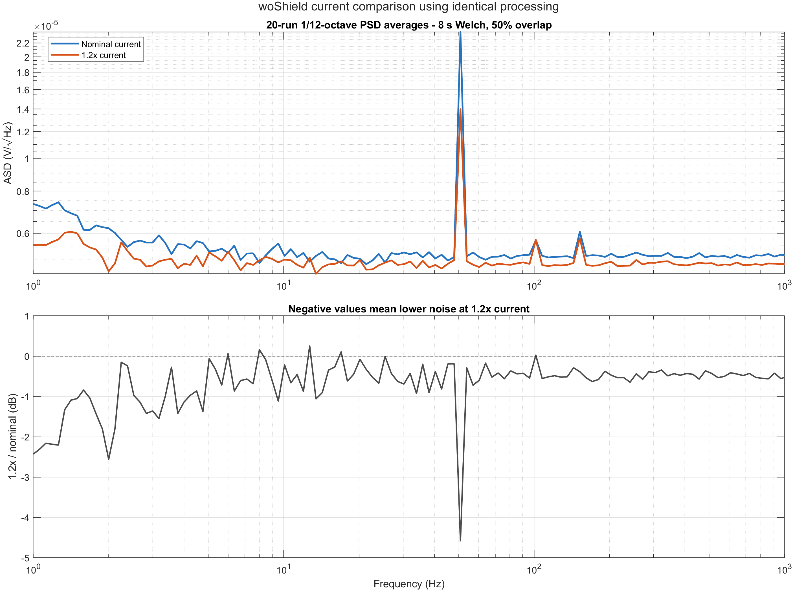

# 2026-08-29 - T-20260817-01 - Unicorn CSA RevA COB 噪声测试合并报告

## 1. 报告目的与当前状态

本文档合并截至 2026-08-29 已完成的 Unicorn CSA RevA COB 噪声测试、MATLAB 频谱验证和测试链路排查结果，作为后续复测与设计迭代的统一基线。

当前最重要的结论如下：

- MATLAB 的单边 PSD 归一化、Hamming 窗、PSD-first 跨次平均和 ASD 单位已经通过合成信号与 MATLAB 内置函数交叉验证，当前约 5 nV/√Hz 的读数不是 FFT 算法错误。
- nominal-current、Gain = 1001、woShield 条件下，1 kHz 输入等效 ASD 为 `5.10851 nV/√Hz`；扣除反馈网络热噪声后，DUT 估计为 `5.09238 nV/√Hz`。
- 设计目标已修正为 `4.6 nV/√Hz @ 1 µA`。因此 nominal-current 的 DUT 结果比目标高 `10.70%`，即 `+0.883 dB`。
- 电流增加到 1.2 倍后，1 kHz DUT 估计值降为 `4.82259 nV/√Hz`，相对 nominal-current 下降 `5.30%`，说明存在明确的电流相关噪声成分。
- 屏蔽罩对 1 kHz 宽带底噪没有实质改善：wiShield 相对 woShield 仅 `+0.0133 dB`；屏蔽主要改变了 50 Hz 和 150 Hz 工频相关谱线。
- 新增 Gain = 101 的 10 个文件、120 段平均初步结果为 `5.08782 nV/√Hz @ 1 kHz`。该组已确认在 nominal `1 µA`、woShield 条件下采集，与 Gain = 1001 的 `5.10851 nV/√Hz` 只差 `-0.405%`，说明标称增益换算总体正确，并初步说明 PXI 输出侧本底不是当前绝对偏差的主要原因。
- 反馈 `10 kΩ`、接地 `10 Ω` 的实测 mismatch 很小。DUT 拆下时测到约 `5 kΩ`，来自反馈 `10 kΩ` 与输出负载 `10 kΩ + 10 Ω` 两条路径并联，不代表反馈电阻实际变成 `5 kΩ`。
- 已进行斩波频率变化试验，用户观察到 1 kHz 噪声没有明显变化。该结果降低了“噪声主要由与斩波频率成比例的开关注入造成”的可能性，但目前没有归档频率点和原始数据，因此仍作为定性结论。

尚未最终解决的问题是：nominal `1 µA` 条件下，DUT 为什么仍比 PSS + PNOISE 的 `4.6 nV/√Hz` 高约 `10.7%`。现阶段最可能是实际芯片/PVT差异与共同测试链路噪声叠加，仍需短路基线、同方法 OPA189 1 kHz 基线及供电/地回流 A/B 测试进一步分离。

## 2. DUT、反馈网络与测量链路

### 2.1 低频噪声测试连接

主要测试连接为：

```text
                                Rf = 10 kΩ / 1 kΩ
                         +------/\/\/\/\------+ 
                         |                    |
AGND ---- Rg = 10 Ω -----+---- DUT IN−      DUT OUT ---- 22 µF ---- PXI-5922 CH0
                              DUT IN+ ---- AGND                       1 MΩ input
```

两档标称噪声增益分别为：

\[
NG_{1001}=1+\frac{10\,k\Omega}{10\,\Omega}=1001
\]

\[
NG_{101}=1+\frac{1\,k\Omega}{10\,\Omega}=101
\]

板上还存在约 `10 kΩ` 的输出负载。只要该负载连接在 `OUT → AGND`，它只增加输出负载，不属于反馈分压网络，不会把工作状态下的噪声增益从 1001 改为 501。

### 2.2 PXI-5922采集配置

从 TDMS 内嵌 InstrumentStudio 配置确认：

- 通道：`Channel 0 (PXI1Slot2/0)`；
- 输入耦合：DC；
- 输入阻抗：1 MΩ；
- 探头衰减：1×；
- 采样率：50 kSa/s；
- InstrumentStudio FFT 通道未保存，所有结果均由时域 Channel 0 数据在 MATLAB 中重建。

TDMS 没有显式保存 PXI Flex FIR antialias filter 类型和最终硬件量程，因此正式复测仍应在现场记录这两项。

NI 给出的 PXI-5922 alias-free 带宽为 `0.4 Fs`。在 `Fs = 50 kSa/s` 时，0–20 kHz 为正式无混叠范围，20–25 kHz 已进入滤波器过渡区。因此本文保留历史 `1 Hz–25 kHz` 积分值用于同设置相对比较，但不把它解释为完整、平坦的 DUT 宽带噪声。目标频带 1 Hz–1 kHz 和 Gain = 101 的 100 Hz–10 kHz 均位于安全范围内。

参考：[NI PXI-5922 Specifications](https://download.ni.com/support/manuals/374033b.pdf)。

## 3. 数据组

| 数据组 | 增益 | 偏置条件 | 屏蔽 | 文件数 | 每文件点数 | 每文件时长 | 正式用途 |
| --- | ---: | --- | --- | ---: | ---: | ---: | --- |
| woShield nominal | 1001 | nominal，按 1 µA 记录 | 无 | 20 | 1,100,002 | 22.00004 s | 1 Hz–1 kHz 主基线 |
| wiShield nominal | 1001 | nominal，按 1 µA 记录 | 有 | 20 | 1,100,002 | 22.00004 s | 屏蔽罩 A/B |
| woShield 1.2× current | 1001 | 1.2× nominal | 无 | 20 | 1,100,002 | 22.00004 s | 电流 A/B |
| woShield Gain = 101 | 101 | nominal 1 µA，已确认 | 无 | 10 | 1,200,000 | 24 s | 100 Hz–10 kHz 与增益 A/B |

说明：Gain = 101 组的偏置电流已由用户于2026-08-29确认为 `1 µA`，因此可以与 nominal、Gain = 1001、woShield 数据进行同偏置增益交叉验证。

## 4. 正式频谱算法

### 4.1 Gain = 1001：1 Hz–1 kHz主结果

三组 Gain = 1001 数据统一使用：

1. 每个文件独立读取 Channel 0，并独立去除均值；不同文件不拼接。
2. 每段长度为 8 s，即 400,000 点。
3. 相邻段 50% overlap，即 200,000 点。
4. 每个 22.00004 s 文件得到 4 个完整段，舍弃末尾 2.00004 s。
5. 窗函数为 periodic Hamming。
6. `NFFT = 400,000`，频率间隔 `df = 0.125 Hz`。
7. Hamming ENBW 为 `0.170353 Hz`。
8. 每个文件先得到 Welch PSD；20 个文件在 `V²/Hz` 功率域等权平均，最后开平方得到 `V/√Hz`。
9. 1 Hz、10 Hz 和 1 kHz 报告值使用以目标频率为中心的 1/12 倍频程功率平均，不使用单个 FFT bin。
10. 完整 1,100,002 点 FFT 仅保留用于更细频率间隔的窄带 spur 检查，不作为主展示曲线。

每种条件共包含 `20 × 4 = 80` 个 Welch 段。

### 4.2 Gain = 101：100 Hz–10 kHz结果

Gain = 101 数据按照用户制定的中频方法处理：

1. 每个 TDMS 文件读取前 1,200,000 点，即 24 s。
2. 每 100,000 点为一段，段长 2 s，不重叠。
3. 每文件 12 段，10 个文件合计 120 段。
4. 每段独立去除均值。
5. 窗函数为 periodic Hamming。
6. `NFFT = 100,000`，`df = 0.5 Hz`，ENBW 为 `0.681413 Hz`。
7. 120 个 periodogram PSD 在 `V²/Hz` 域平均，最后开平方。
8. 输出 ASD 除以 101，得到输入等效 ASD。

该方法牺牲低频分辨率，换取 100 Hz–10 kHz 范围内更多独立段平均；它不用于 1 Hz 指标。

### 4.3 统计与单位规则

跨段、跨文件均遵循：

\[
S_{avg}(f)=\frac{1}{M}\sum_{m=1}^{M}S_m(f)
\]

\[
ASD_{avg}(f)=\sqrt{S_{avg}(f)}
\]

不能直接平均 ASD，也不能直接平均 dB。独立噪声源的扣除同样必须在 PSD 功率域完成。

## 5. Gain = 1001正式结果

### 5.1 输出端ASD

以下均为 PXI 输入处、即 DUT 放大后的输出端结果。

频带积分统一由保存的 full-resolution PSD 按“FFT bin与目标频带的实际重叠宽度”重新计算；因此下表的1 Hz–25 kHz值会比各目录中较早的`Analysis_Summary.txt`相差约0.001–0.003 µVrms。

| 指标 | woShield nominal | wiShield nominal | woShield 1.2× current |
| --- | ---: | ---: | ---: |
| 1 Hz centered ASD | 7.32707 µV/√Hz | 7.57799 µV/√Hz | 5.53853 µV/√Hz |
| 10 Hz centered ASD | 5.11283 µV/√Hz | 5.21939 µV/√Hz | 5.03697 µV/√Hz |
| 1 kHz centered ASD | 5.11362 µV/√Hz | 5.12145 µV/√Hz | 4.84446 µV/√Hz |
| 1 Hz–25 kHz 积分噪声 | 680.542 µVrms | 681.711 µVrms | 701.767 µVrms |
| 50 Hz peak ASD | 92.7971 µV/√Hz | 107.973 µV/√Hz | 52.3581 µV/√Hz |
| 49.5–50.5 Hz spur积分 | 39.9401 µVrms | 46.2332 µVrms | 23.0011 µVrms |
| 150 Hz附近peak ASD | 18.2723 µV/√Hz | 15.4671 µV/√Hz | 16.2138 µV/√Hz |
| 149.5–150.5 Hz spur积分 | 10.8962 µVrms | 9.35498 µVrms | 10.3937 µVrms |
| 10–25 kHz相对1–10 kHz滚降 | −2.21082 dB | −2.19035 dB | −0.983681 dB |

### 5.2 除以1001后的输入等效ASD

| 指标 | woShield nominal | wiShield nominal | woShield 1.2× current |
| --- | ---: | ---: | ---: |
| 1 Hz centered ASD | 7.31975 nV/√Hz | 7.57042 nV/√Hz | 5.53300 nV/√Hz |
| 10 Hz centered ASD | 5.10772 nV/√Hz | 5.21417 nV/√Hz | 5.03194 nV/√Hz |
| 1 kHz centered ASD | 5.10851 nV/√Hz | 5.11633 nV/√Hz | 4.83962 nV/√Hz |

### 5.3 屏蔽罩影响

wiShield 相对 woShield nominal：

| 指标 | 变化 |
| --- | ---: |
| 1 Hz ASD | +0.292 dB |
| 10 Hz ASD | +0.179 dB |
| 1 kHz ASD | +0.0133 dB |
| 1 Hz–25 kHz积分噪声 | +0.0149 dB |
| 50 Hz peak | +1.316 dB |
| 150 Hz peak | −1.448 dB |

结论：屏蔽罩没有降低宽带噪声。50 Hz 与 150 Hz 的相反变化说明屏蔽层更可能改变了工频耦合和回流路径，而不是降低 DUT 本征白噪声。



### 5.4 1.2×电流影响

1.2× current 相对 nominal-current woShield：

| 指标 | 幅度变化 | dB变化 |
| --- | ---: | ---: |
| 1 Hz ASD | −24.410% | −2.431 dB |
| 10 Hz ASD | −1.484% | −0.130 dB |
| 1 kHz ASD | −5.264% | −0.470 dB |
| 10–100 Hz RMS-ASD | −18.063% | −1.730 dB |
| 100 Hz–1 kHz RMS-ASD | −5.367% | −0.479 dB |
| 1 Hz–1 kHz积分噪声 | −7.088% | −0.639 dB |
| 1 Hz–25 kHz积分噪声 | +3.119% | +0.267 dB |
| 50 Hz peak | −43.578% | −4.971 dB |

1 kHz下降是稳定且可重复的；对比脚本给出的 repeatability-only 95% 区间为 `−6.218% 至 −4.299%`，不跨越零，但该区间不包含顺序测试造成的系统误差。10–100 Hz 的下降还包含 50 Hz spur 大幅下降的贡献，不能全部归因于 DUT 本征噪声改善。与此同时，1–25 kHz积分值上升、10–25 kHz滚降减小，推测与偏置增加后 DUT 带宽提高有关。由于20–25 kHz处于PXI滤波过渡区，该高频结论只用于相同设置下的相对比较。



## 6. Gain = 101新增初步结果

### 6.1 120段PSD平均

该组已经核验分段、窗函数、PSD平均和1 kHz标量结果，但尚未完成与三组20-run正式流程同等级的异常段检查、重复波形检查、置信区间及标量CSV导出，因此以下结果标记为初步结果。

| 指标 | 输出端 | 除以101后的输入等效 |
| --- | ---: | ---: |
| 100 Hz centered ASD | 0.911585 µV/√Hz | 9.02560 nV/√Hz |
| 1 kHz centered ASD | 0.513870 µV/√Hz | 5.08782 nV/√Hz |
| 10 kHz centered ASD | 0.532187 µV/√Hz | 5.26918 nV/√Hz |
| 100 Hz–10 kHz RMS-ASD | 0.526384 µV/√Hz | 5.21172 nV/√Hz |
| 100 Hz–10 kHz积分噪声 | 52.3709 µVrms | 518.524 nVrms |

100 Hz centered带宽覆盖100 Hz工频偶次谐波，因此该点明显高于1 kHz白噪声底，不应作为器件宽带白噪声代表值。

10个文件各自将12段PSD平均后，1 kHz输入等效ASD统计为：

- 文件间ASD平均：`5.08668 nV/√Hz`；
- 文件间标准差：`0.11355 nV/√Hz`；
- 最小值：`4.91177 nV/√Hz`；
- 最大值：`5.28051 nV/√Hz`；
- 全120段PSD-first总平均：`5.08782 nV/√Hz`。

### 6.2 Gain = 101与Gain = 1001交叉验证

Gain = 101组已确认为nominal `1 µA`、woShield条件，因此与Gain = 1001、woShield nominal组比较：

\[
\frac{ASD_{out,1001}}{ASD_{out,101}}
=\frac{5.113616}{0.513870}
=9.95119
\]

理论增益比为：

\[
\frac{1001}{101}=9.91089
\]

输出ASD比例相对理论值只高 `0.407%`。折算到输入端后：

\[
5.08782\ \mathrm{nV}/\sqrt{Hz}
\quad\text{vs}\quad
5.10851\ \mathrm{nV}/\sqrt{Hz}
\]

差异仅 `−0.405%`，即 `−0.0353 dB`。这初步支持以下判断：

- 1001与101的标称增益换算总体正确；
- 1 kHz读数主要随DUT前端噪声增益缩放；
- PXI和22 µF之后的固定输出侧噪声不是1 kHz结果的主要组成部分；
- 反馈电阻档位不存在约10%的有效阻值错误。

限制条件：两组数据的采集日期、可能的PXI量程以及频谱分段配置不同，并且没有同步短路基线。因此本节是很强的增益交叉检查，但还不是对PXI固定输出侧本底的最终排除证据。

## 7. 1 kHz噪声预算

总噪声预算遵循功率相加：

\[
e_{meas,in}^2
=e_{DUT}^2+e_{res}^2+
\left(\frac{e_{PXI,out}}{NG}\right)^2+\cdots
\]

其中 `e_meas,in = e_meas,out / NG`。任何底噪扣除也必须先转换到PSD功率域。

### 7.1 反馈电阻网络热噪声

在25°C下，反馈网络输入等效热噪声为：

\[
e_{R,in}=\sqrt{4kT(R_f\parallel R_g)}
\]

| 档位 | \(R_f\) | \(R_g\) | 输入等效电阻噪声 |
| --- | ---: | ---: | ---: |
| Gain = 1001 | 10 kΩ | 10 Ω | 0.40558 nV/√Hz |
| Gain = 101 | 1 kΩ | 10 Ω | 0.40376 nV/√Hz |

两档反馈网络的输入等效热噪声几乎相同。

### 7.2 目标与nominal 1 µA实测

设计目标为：

\[
e_{DUT,target}=4.6\ \mathrm{nV}/\sqrt{Hz}\ @1\ \mu A
\]

包含Gain = 1001反馈电阻后，理论输入总噪声为：

\[
e_{expected,in}
=\sqrt{4.6^2+0.40558^2}
=4.61784\ \mathrm{nV}/\sqrt{Hz}
\]

对应输出端：

\[
e_{expected,out}=4.62246\ \mathrm{\mu V}/\sqrt{Hz}
\]

woShield nominal实测为：

\[
e_{meas,in}=\frac{5.113616\ \mu V/\sqrt{Hz}}{1001}
=5.10851\ \mathrm{nV}/\sqrt{Hz}
\]

扣除反馈电阻PSD后：

\[
e_{DUT,estimated}
=\sqrt{5.10851^2-0.40558^2}
=5.09238\ \mathrm{nV}/\sqrt{Hz}
\]

相对目标：

\[
\frac{5.09238}{4.6}-1=10.70\%
\]

即 `+0.883 dB`。

若把差异表示为另一个不相关输入噪声源，则：

\[
e_{extra}
=\sqrt{5.10851^2-4.6^2-0.40558^2}
=2.18457\ \mathrm{nV}/\sqrt{Hz}
\]

该值是平方残差，不能用 `5.10851 − 4.6` 的线性差替代。

### 7.3 各条件扣除反馈网络后的1 kHz结果

| 条件 | 除以噪声增益 | 扣除反馈网络PSD后 | 相对4.6 nV/√Hz |
| --- | ---: | ---: | ---: |
| Gain = 1001, nominal woShield | 5.10851 nV/√Hz | 5.09238 nV/√Hz | +10.70% |
| Gain = 1001, nominal wiShield | 5.11633 nV/√Hz | 5.10023 nV/√Hz | +10.87% |
| Gain = 1001, 1.2× current | 4.83962 nV/√Hz | 4.82259 nV/√Hz | 不直接与1 µA目标比较 |
| Gain = 101, nominal 1 µA woShield | 5.08782 nV/√Hz | 5.07177 nV/√Hz | +10.26% |

1.2× current必须与相同电流条件下的PSS + PNOISE结果比较，不能简单使用 `4.6/√1.2` 代替完整斩波电路仿真。

## 8. OPA189同环境交叉验证

此前使用相同测量环境、Gain = 1001反馈网络和PXI-5922测试OPA189。±3 V、woShield条件的5–40 Hz平坦区中位ASD为：

\[
e_{OPA189,meas}=5.4267\ \mathrm{nV}/\sqrt{Hz}
\]

TI给出的OPA189典型电压噪声密度在10 Hz、100 Hz、1 kHz和10 kHz均为 `5.2 nV/√Hz`。若使用该典型值并扣除反馈电阻，得到共同平方残差估计：

\[
e_{common}
=\sqrt{5.4267^2-5.2^2-0.40558^2}
=1.498\ \mathrm{nV}/\sqrt{Hz}
\]

若暂时把该残差全部视为共同测试链路噪声，则nominal DUT可估算为：

\[
e_{DUT,common-corrected}
=\sqrt{5.10851^2-0.40558^2-1.498^2}
=4.867\ \mathrm{nV}/\sqrt{Hz}
\]

此时相对4.6目标的偏差缩小为 `+5.80%`。

限制条件：`5.2 nV/√Hz`是OPA189典型值，不是被测那颗OPA189的已校准真值；旧OPA189处理数据也只保存到100 Hz。因此 `1.498 nV/√Hz`只能作为共同底噪的敏感性估计，不能作为正式PSD扣除值。

参考：

- [OPA189正式测试报告](2026-08-14-T-20260814-01.md)
- [TI OPA189 Datasheet](https://www.ti.com/lit/ds/symlink/opa189.pdf)

## 9. 电阻、负载与增益排查

### 9.1 实测结论

- `10 kΩ`反馈电阻与`10 Ω`接地电阻的阻值mismatch很小。
- DUT拆下、整板断电时，从OUT到IN−或OUT到AGND测得约`5 kΩ`。
- 板上存在`10 kΩ`输出负载。

对下述无源网络：

```text
OUT ---- Rf=10 kΩ ---- IN− ---- Rg=10 Ω ---- AGND
 |
 +----- RL=10 kΩ --------------------------- AGND
```

万用表从OUT到IN−看到：

\[
R_{meas}=R_f\parallel(R_L+R_g)
=10\,000\parallel10\,010
=5002.5\ \Omega
\]

因此约`5 kΩ`是正常的无源并联等效值。只要`RL`连接到AGND而不是IN−，工作状态下的反馈电阻仍为`10 kΩ`，噪声增益仍为1001。

### 9.2 对噪声结论的影响

要仅靠反馈比误差把理论4.6 nV/√Hz解释为nominal实测输出，实际噪声增益需要约1107；等效于：

- `Rg = 10 Ω`时，`Rf ≈ 11.06 kΩ`；或
- `Rf = 10 kΩ`时，`Rg ≈ 9.04 Ω`。

实测mismatch远小于上述约10%的偏差，因此反馈电阻比不是当前绝对噪声偏高的主要原因。

输出负载`10 kΩ`连接在运放低输出阻抗节点，其Johnson电流噪声被闭环输出阻抗强烈抑制；在正常低输出阻抗下不能把`10 kΩ`的开路`12.8 nV/√Hz`直接加到输出噪声预算中。

## 10. 斩波仿真与频率排查

### 10.1 仿真方法

`4.6 nV/√Hz @ 1 µA`来自PSS + PNOISE，而不是普通stationary noise分析。因此“仿真完全漏掉周期噪声折叠”的初始担忧已经排除。

仍需确认：

- PNOISE使用适合连续输出的time-average设置；
- `maxsideband`已经做5、10、20、40、80等递增收敛；
- PSS包含实际clock driver、HV level shifter、供电阻抗和PEX寄生；
- 理想时钟源不会自动包含真实clock jitter和driver电源噪声；
- 1.2× current有独立PSS + PNOISE结果。

### 10.2 斩波频率试验

用户已试验改变斩波时钟频率，观察到1 kHz噪声没有明显变化。当前结论为：

- 强烈随每秒开关次数变化的随机charge-injection噪声不太像主导项；
- 确定性clock feedthrough通常表现为`fchop`及其谐波spur，不一定抬高1 kHz白底；
- 如果clock driver使用理想源进行PNOISE，真实jitter/供电回流仍可能未建模；
- 由于没有归档具体频率、保持不变的其他条件和原始波形，该试验暂不用于定量扣除。

当前实测方向是主偏置从1.0增加到1.2后噪声下降，因此不建议为降低1 kHz噪声而同时降低主OTA偏置电流。若继续优化斩波，应固定主偏置、小步扫描`fchop`，并使用PSTB检查周期稳定性。

## 11. 测量算法验证

MATLAB合成验证复刻了`Fs = 50 kSa/s`、1,100,002点和20次记录，并与`periodogram`及单段`pwelch`交叉检查。

关键结果：

| 验证项 | 理论值 | 测量值 | 误差 |
| --- | ---: | ---: | ---: |
| 100 Hz–10 kHz白噪声PSD-first ASD | 6.324555 µV/√Hz | 6.323974 µV/√Hz | −0.00919% |
| 1 Hz–25 kHz积分噪声 | 999.980 µVrms | 999.795 µVrms | −0.0184% |
| 50 Hz相干正弦peak ASD | 401.783 µV/√Hz | 401.783 µV/√Hz | <1e−12% |
| 50 Hz正弦主瓣积分 | 100.000 µVrms | 100.000 µVrms | <1e−12% |

其他检查：

- 显式PSD公式与MATLAB `periodogram`最大归一化差：`6.32e−16`；
- 显式PSD公式与单段`pwelch`最大归一化差：`6.32e−16`；
- 最大Parseval相对误差：`3.44e−16`；
- 自动验证：`12/12 PASS`；
- 仓库原有`noiseSpectrumTest`：`5/5 PASS`。

验证表明当前频谱方法无系统性归一化错误。1 Hz处仍比中高频具有更大统计波动，因为其1/12倍频程带宽很窄；1 kHz与100 Hz–10 kHz宽带结果的统计稳定性明显更好。

## 12. 当前工程判断

根据目前全部证据，嫌疑项排序更新为：

1. **实际DUT与PSS + PNOISE目标的PVT/工作点/版图差异。** 这是当前无法由屏蔽、频率、反馈阻值或PXI增益解释的主要部分。
2. **共同测试链路或板级地/供电噪声。** OPA189同环境结果提示可能存在约1.5 nV/√Hz量级的共同平方残差，但尚未经过已知低噪声源正式标定。
3. **clock driver、HV level shifter或真实供电噪声未完整进入PNOISE模型。** 改变`fchop`无明显变化使纯事件率相关机制降级，但不能排除jitter和回流。
4. **实际闭环AC增益。** Gain = 101/1001结果已经把约10%的反馈比错误基本排除，但仍应以1 kHz小信号直接测量作为最终确认。

当前证据不支持以下项目为主要原因：

- MATLAB PSD/ASD计算错误；
- 20次平均方法错误；
- 屏蔽不足造成的宽带白噪声；
- PXI正常本底直接抬高到约5 nV/√Hz输入等效；
- 10 kΩ/10 Ω阻值mismatch；
- 板上测得5 kΩ意味着实际反馈电阻为5 kΩ；
- 22 µF与1 MΩ高通在1 kHz造成幅度偏高。

## 13. 下一步建议

按判别能力排序：

1. **实测1 kHz闭环增益。** 给非反相输入注入小信号，直接测`Vout/Vin`，并记录100 Hz、1 kHz、10 kHz三点。
2. **做同设置低阻短路基线。** 保持PXI量程、1 MΩ、DC、FIR、采样率、电缆和22 µF不变，在电容DUT侧低阻短接；PSD必须在功率域扣除。
3. **用相同算法重新获得OPA189 1 kHz基线。** 旧处理数据只到100 Hz；若仍有原始波形，应按Gain = 101或8 s Welch方法直接计算1 kHz。
4. **补跑1.2× current的PSS + PNOISE。** 直接比较仿真与实测电流变化量，不使用简单`1/√I`缩放。
5. **做地与供电A/B。** 将DUT IN+地与10 Ω下端Kelvin连接，关闭不必要数字时钟，比较现有供电与低噪声线性/电池供电。
6. **如继续定位斩波开关，另做高采样率短记录。** 当前50 kSa/s无法直接观察20 kHz以上的`fchop`及其谐波；诊断记录应使用至少`5–10 × fchop`采样率。

正式底噪扣除应使用：

\[
S_{DUT,in}(f)
=\frac{S_{meas,out}(f)-S_{baseline,out}(f)}{NG_{actual}^2}
-4kT(R_f\parallel R_g)
\]

最后再计算：

\[
ASD_{DUT,in}(f)=\sqrt{\max(S_{DUT,in}(f),0)}
\]

## 14. 数据、脚本与结果索引

### Gain = 1001，woShield nominal

- 原始目录：`Unicorn_CSA_RevA-COB_woShiled_20260828/`
- 分析入口：`Unicorn_CSA_RevA-COB_woShiled_20260828/analyze_20run_welch_8s_noise.m`
- 结果目录：`Unicorn_CSA_RevA-COB_woShiled_20260828/analysis_results/welch_8s_50pct/`

### Gain = 1001，wiShield nominal

- 原始目录：`Unicorn_CSA_RevA-COB_wiShiled_20260828/`
- 分析入口：`Unicorn_CSA_RevA-COB_wiShiled_20260828/analyze_20run_welch_8s_noise.m`
- 结果目录：`Unicorn_CSA_RevA-COB_wiShiled_20260828/analysis_results/welch_8s_50pct/`
- 屏蔽对比入口：`Unicorn_CSA_RevA-COB_wiShiled_20260828/compare_wi_vs_wo_welch_8s.m`

### Gain = 1001，woShield 1.2× current

- 原始目录：`Unicorn_CSA_RevA-COB_woShiled_1p2_20260828/`
- 分析入口：`Unicorn_CSA_RevA-COB_woShiled_1p2_20260828/analyze_20run_welch_8s_noise.m`
- 结果目录：`Unicorn_CSA_RevA-COB_woShiled_1p2_20260828/analysis_results/welch_8s_50pct/`
- 电流对比入口：`Unicorn_CSA_RevA-COB_woShiled_1p2_20260828/compare_1p2_vs_nominal_wo_noise.m`

### Gain = 101，woShield

- 原始目录：`Unicorn_CSA_RevA-COB_woShiled_Gain101_20260829/`
- 用户分析入口：`periodogram_mode_Gain101.mlx`
- 保存工作区：`Unicorn_CSA_RevA-COB_woShiled_Gain101_20260829.mat`
- 保存PSD矩阵：`psdV2PerHz_array`，尺寸`50,001 × 120`。
- 当前MATLAB图：`combine_Gain1001_Gain101.fig`。

### 验证与历史报告

- 合成验证入口：`Unicorn_CSA_RevA-COB_woShiled_20260828/validate_synthetic_noise_psd_method.m`
- 合成验证结果：`Unicorn_CSA_RevA-COB_woShiled_20260828/validation_results/`
- [2026-08-28屏蔽罩测试报告](2026-08-28-T-20260817-01.md)
- [2026-08-14 OPA189正式测试报告](2026-08-14-T-20260814-01.md)

## 15. 结果状态

- Gain = 1001三组20次TDMS：已完成正式8 s Welch分析，均无精确重复波形。质量检查标记但未剔除的记录为 nominal runs 13/16、wiShield runs 12/19、1.2× current runs 10/12。
- woShield旧Run 14重复问题：旧文件已删除并重采，新Run 14与其他波形不重复。
- Gain = 101十个TDMS：已完成用户2 s、120段PSD平均核验；采集条件已确认为nominal `1 µA`、woShield，正式异常段/重复检查、置信区间和标量CSV尚未完成。
- 电阻检查：已完成，未发现可解释约10%偏差的阻值mismatch。
- 斩波频率检查：已有定性结论，具体扫频点和原始数据尚未归档。
- 绝对底噪标定：尚未完成，不能正式扣除OPA189推导的共同残差。
