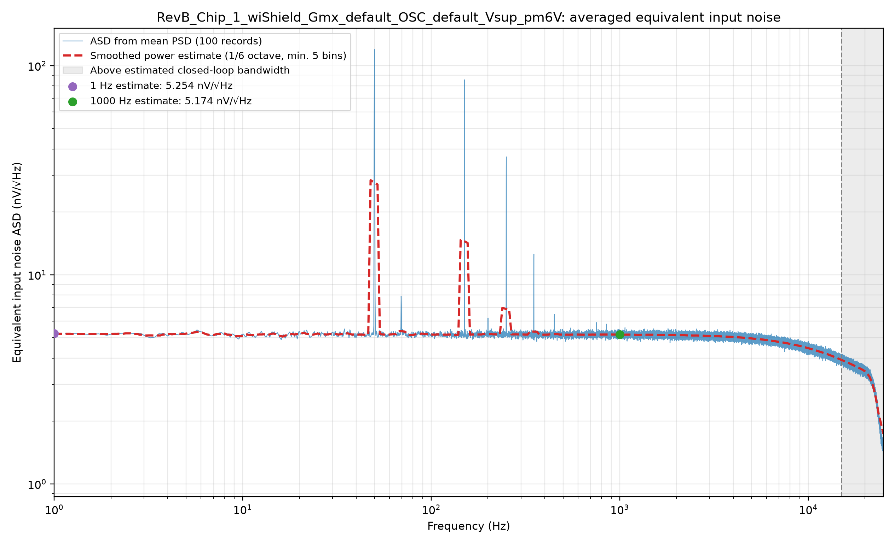
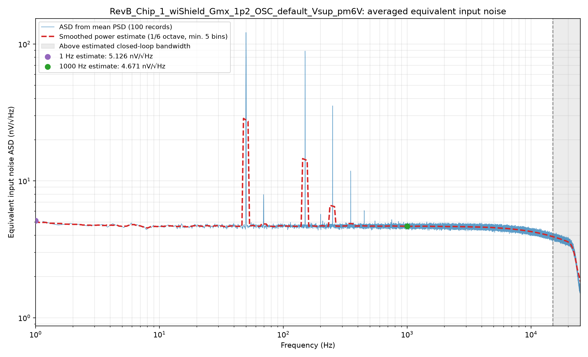
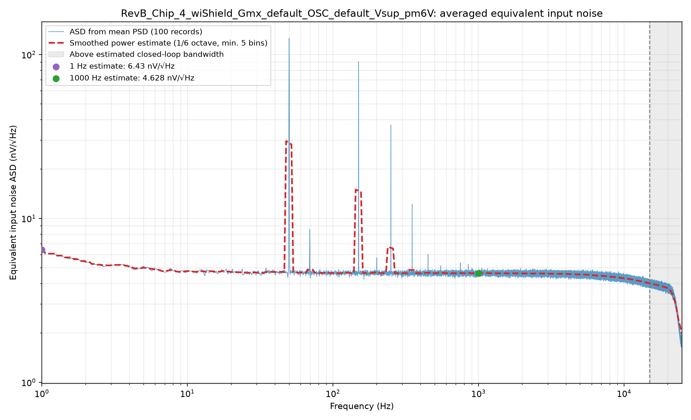

# 2026-09-03 - T-20260817-01 - Unicorn CSA RevB（with PMU）噪声测试记录

## 1. 结论摘要

本记录收束 2026-09-02 至 2026-09-03 完成的三组 RevB（with PMU）噪声测试。三组各包含 100 个 22 s TDMS 记录，共 300 个原始文件、330,000,000 个 `float64` 样本和 2,100 个 Welch 段。TDMS 与频谱文件数量匹配，所有记录的采集参数一致，未发现接近削顶的记录。

以下以跨 100 次记录先平均 PSD、再开平方得到的 1/6 倍频程平滑值作为主指标：

| 测试条件 | 1 Hz 输入等效 ASD | 1 kHz 输入等效 ASD |
| --- | ---: | ---: |
| Chip 1，Gmx default | 5.254 nV/√Hz | 5.174 nV/√Hz |
| Chip 1，Gmx `1p2` | 5.126 nV/√Hz | 4.671 nV/√Hz |
| Chip 4，Gmx default | 6.430 nV/√Hz | 4.628 nV/√Hz |

主要观察：

- Chip 1 的 `Gmx_1p2` 相对 Gmx default，1 kHz ASD 降低 `9.729%`（`−0.889 dB`）；1 Hz 仅降低 `2.437%`。
- 相同 default 条件下，Chip 4 相对 Chip 1 的 1 kHz ASD 低 `10.553%`（`−0.969 dB`），但 1 Hz ASD 高 `22.401%`。这说明样片间低频噪声差异比 1 kHz 白噪声底差异更明显。
- 三组均存在共同的约 50、150、250 和 350 Hz 窄带谱线；1 kHz 附近未见同等级的单一主导谱线。
- 1 kHz 主结果使用 `943.947–1059.341 Hz` 内 606 个 FFT bin 的 PSD 功率平均，不是单个 1 kHz bin，因此比单 bin 对随机扰动更稳健；但它不会去除该频带内真实存在的斩波相关宽带噪声或窄带能量。
- 本记录按用户决定不评估 offset。TDMS 中的 DC 均值仅保留为原始元数据，不作为本次结论。

本次**采集和频谱处理完整性判定为通过**。器件噪声性能暂不作正式 Pass/Fail：这里报告的是整个 DUT、反馈网络、夹具和 PXI-5922 共同贡献后除以标称增益 1001 的总输入等效噪声，尚未进行采集链基线扣除、反馈网络热噪声扣除或实际闭环增益校准。

## 2. 基本信息与范围

- 关联任务：`T-20260817-01`（DUT 低压噪声测试）。
- 测试对象：Unicorn CSA RevB（with PMU）。
- 执行人：`@chiger-git`（来自测试安排）。
- 采集时间：2026-09-02 15:29 UTC 至 17:48 UTC；北京时间跨 2026-09-02 至 2026-09-03。
- 操作系统：Windows 10。
- 采集设备：NI PXI-5922，资源名 `PXI1Slot2`，序列号 `2094935`。
- 驱动：NI-SCOPE `23.8.0`（2023 Q4）。
- 本次工作的基线 commit：`5a271ce`。
- 归档 commit：本记录、RevB Python 脚本和六个汇总结果文件随同提交；准确哈希以包含本文件的 Git commit 为准。

原任务安排写的是 ±3 V、外置 PMU；本次实际条件由 TDMS/task ID 记录为 RevB with PMU、DUT 供电 ±6 V。它属于同一噪声测试任务的后续扩展条件，不能与原任务范围混写。

## 3. DUT 条件

三组共同条件：

- 硬件版本：RevB（with PMU），PMU enabled。
- 金属防护壳：已安装（`wiShield`）。
- OSC：default。
- DUT 供电：±6 V（`Vsup_pm6V`）。
- 噪声增益：1001 V/V。
- 运放 GBW 元数据：15 MHz；估算闭环带宽 `14,985.015 Hz`。

变量条件：

| task_id | 芯片 | Gmx 条件 | 备注 |
| --- | --- | --- | --- |
| `RevB_Chip_1_wiShield_Gmx_default_OSC_default_Vsup_pm6V` | Chip 1 | default | default 控制码按项目 README 记录为 `4'b0110` |
| `RevB_Chip_1_wiShield_Gmx_1p2_OSC_default_Vsup_pm6V` | Chip 1 | `1p2` | task ID 表示 Gmx 1.2 条件；实际寄存器码/实测偏置电流未写入 TDMS |
| `RevB_Chip_4_wiShield_Gmx_default_OSC_default_Vsup_pm6V` | Chip 4 | default | 其余条件与 Chip 1 default 相同 |

## 4. 采集配置与数据完整性

| 项目 | 三组实际值 |
| --- | --- |
| 物理通道 | CH0 |
| 采样率 | 50,000 Sa/s |
| 每记录点数 | 1,100,000 |
| 每记录时长 | 22 s |
| 数据类型 | `float64` |
| 输入阻抗 | 1 MΩ |
| 输入量程 | 2.0 Vpp |
| 耦合 | DC |
| 带宽配置 | `max_input_frequency=-1.0`，采集卡全带宽 |
| 触发 | Immediate |
| 每组记录数 | 100，编号 `0001–0100` |

数据清单：

| 数据组 | 首个/末个记录开始时间（UTC） | TDMS | 原始大小 | NPZ | 近削顶记录 |
| --- | --- | ---: | ---: | ---: | ---: |
| Chip 1，Gmx default | 15:29:48 / 16:06:12 | 100 | 880,196,500 B | 100 | 0 |
| Chip 4，Gmx default | 16:20:00 / 16:56:23 | 100 | 880,196,500 B | 100 | 0 |
| Chip 1，Gmx `1p2` | 17:11:54 / 17:48:18 | 100 | 880,196,100 B | 100 | 0 |
| **合计** | — | **300** | **2,640,589,100 B** | **300** | **0** |

完整性检查结果：

- 三组实际采样率均只有一个取值：50,000 Sa/s。
- 三组记录长度均只有一个取值：1,100,000 点。
- 三组通道、阻抗、量程、数据类型和触发方式一致。
- 每组 TDMS 与对应 NPZ 均为 100 个，编号连续覆盖 `0001–0100`。
- 300 个 TDMS 的 `near_clipping` 均为 false。
- 原始 TDMS 未建立逐文件 SHA-256 manifest；正式迁移或长期归档前应补做。

## 5. 频谱处理方法

分析入口：

- [`analyze_dut_revb_pmu_noise.py`](../../../../Unicorn_CSA_RevB-COB/analyze_dut_revb_pmu_noise.py)
- [`plot_dut_revb_pmu_noise.py`](../../../../Unicorn_CSA_RevB-COB/plot_dut_revb_pmu_noise.py)
- [`run_dut_revb_pmu_noise_pipeline.py`](../../../../Unicorn_CSA_RevB-COB/run_dut_revb_pmu_noise_pipeline.py)

Welch 参数：

- Hann 窗；
- `nperseg=262144`；
- `noverlap=131072`（50%）；
- constant detrend；
- mean averaging；
- one-sided、`scaling="density"`；
- 频率分辨率 `0.1907348633 Hz`；
- 每个 22 s 文件得到 7 个 Welch 段，每组共 700 段。

每个文件先得到输入等效 PSD：

\[
S_{in,i}(f)=\frac{S_{out,i}(f)}{1001^2}
\]

100 个文件在功率域做算术平均，最后开平方并转换单位：

\[
ASD_{in}(f)=10^9\sqrt{\frac{1}{100}\sum_{i=1}^{100}S_{in,i}(f)}
\quad \mathrm{nV}/\sqrt{\mathrm{Hz}}
\]

报告点采用 1/6 倍频程全宽局部功率平均，频点不足时至少使用 5 个 FFT bin：

- 1 Hz：实际覆盖 `0.572205–1.335144 Hz`，5 bins；
- 1 kHz：实际覆盖 `943.946838–1059.341431 Hz`，606 bins。

没有自动删除 50 Hz、电源谐波、斩波谱线或异常频点，也没有对约 15 kHz 的闭环滚降进行反卷积。图中的 15–25 kHz 灰色区域只作带外提示，主要结论聚焦 1 Hz 和 1 kHz。

## 6. 数值结果

### 6.1 平滑主结果与最近 FFT bin

| 条件 | 1 Hz 平滑值 | 最近 bin：0.953674 Hz | 1 kHz 平滑值 | 最近 bin：1000.022888 Hz |
| --- | ---: | ---: | ---: | ---: |
| Chip 1，Gmx default | 5.253586 | 5.193972 | 5.174125 | 5.193690 |
| Chip 1，Gmx `1p2` | 5.125542 | 4.991403 | 4.670712 | 4.751777 |
| Chip 4，Gmx default | 6.430463 | 6.194935 | 4.628117 | 4.743557 |

单位均为 `nV/√Hz`。最近 bin 仅用于追溯；正式比较使用平滑值。

### 6.2 相对 Chip 1 default 的变化

| 条件 | 1 Hz 幅度变化 | 1 Hz dB | 1 kHz 幅度变化 | 1 kHz dB |
| --- | ---: | ---: | ---: | ---: |
| Chip 1，Gmx `1p2` | −2.437% | −0.214 dB | −9.729% | −0.889 dB |
| Chip 4，Gmx default | +22.401% | +1.756 dB | −10.553% | −0.969 dB |

Chip 1 的 Gmx A/B 测试不是交错或随机顺序采集，因此 `−9.729%` 包含可能的时间漂移与测试顺序影响；它是明确的本次实测差异，但仍建议通过回切 default 或 A-B-A 顺序确认可逆性。

### 6.3 与 4.6 nV/√Hz 设计目标的只读比较

此前 RevA 合并报告记录的仿真目标为 `4.6 nV/√Hz @ 1 µA`。若只对本次未经基线扣除的总输入等效测量值做数值比较：

| 条件 | 1 kHz 平滑值 | 相对 4.6 nV/√Hz |
| --- | ---: | ---: |
| Chip 1，Gmx default | 5.174 nV/√Hz | +12.481% |
| Chip 1，Gmx `1p2` | 4.671 nV/√Hz | +1.537% |
| Chip 4，Gmx default | 4.628 nV/√Hz | +0.611% |

该表不能直接作为 DUT 本征噪声验收：`4.6 nV/√Hz` 是器件仿真目标，而本次结果还包含反馈电阻、夹具和采集链贡献；`Gmx_1p2` 的实际电流也没有写入元数据，不能默认等同于 1 µA 条件。

## 7. 共同窄带谱线

从每组 100 个 PSD 的平均结果提取出的主要局部峰值如下：

| 频率 | Chip 1 default | Chip 1 `1p2` | Chip 4 default |
| ---: | ---: | ---: | ---: |
| 49.973 Hz | 119.537 | 121.537 | 125.773 |
| 149.918 Hz | 85.602 | 88.912 | 90.429 |
| 250.053 Hz | 36.653 | 35.393 | 37.198 |
| 约 350 Hz | 12.546 | 11.825 | 12.230 |

单位为 `nV/√Hz`。三组峰值的频率与幅度模式接近，更符合共同测试环境中的 50 Hz 基波及奇次谐波耦合，而不是某一颗芯片独有的宽带噪声变化。脚本未剔除这些峰值。

## 8. 结果图与摘要文件

### Chip 1，Gmx default

- [JSON 摘要](../../../../Unicorn_CSA_RevB-COB/results/RevB_Chip_1_wiShield_Gmx_default_OSC_default_Vsup_pm6V/RevB_Chip_1_wiShield_Gmx_default_OSC_default_Vsup_pm6V_noise_summary.json)，SHA-256：`4321AF82120EAD40838B53F720E8523CFA51CD48172D07A249D75D1392553BC2`
- PNG SHA-256：`9D71158617D98F9941B7DCB3387B1604A2A4A9213486CEB89DA7C202F844D741`

### Chip 1，Gmx `1p2`

- [JSON 摘要](../../../../Unicorn_CSA_RevB-COB/results/RevB_Chip_1_wiShield_Gmx_1p2_OSC_default_Vsup_pm6V/RevB_Chip_1_wiShield_Gmx_1p2_OSC_default_Vsup_pm6V_noise_summary.json)，SHA-256：`81DE69C4AE64D529D5316BF7F0C19B24253052E28AE72C2F7BD31E1913F975EA`
- PNG SHA-256：`71AEB9C5EAA1DE225DE24FBD7E3FBA1FF4DF152DB17BB79F12E0B8486774181F`

### Chip 4，Gmx default

- [JSON 摘要](../../../../Unicorn_CSA_RevB-COB/results/RevB_Chip_4_wiShield_Gmx_default_OSC_default_Vsup_pm6V/RevB_Chip_4_wiShield_Gmx_default_OSC_default_Vsup_pm6V_noise_summary.json)，SHA-256：`C3303090498674B16CCE82582D8C3A8F74DE31D1F3AD0FE2B6A3AA5475F39317`
- PNG SHA-256：`4A67492EAE400C20C1D500F82EE48DB9DB497DF68AFEFB9C4F54CA3195D99F46`

## 9. 验收状态

| 项目 | 状态 | 说明 |
| --- | --- | --- |
| 采样率、点数、阻抗、量程、通道一致 | PASS | 300 个 TDMS 元数据一致 |
| 每组 100 个有效记录 | PASS | 三组均覆盖 `0001–0100` |
| TDMS/NPZ 数量匹配 | PASS | 每组 100/100 |
| `float64` 数据格式 | PASS | 300 个 TDMS 元数据均记录 `float64` |
| 削顶检查 | PASS | `near_clipping=0/300` |
| 1 Hz–25 kHz 结果图 | PASS | 三组均已生成 |
| 1 Hz、1 kHz 指标 | PASS | 最近 bin 与平滑值均已归档 |
| 器件本征噪声指标 | NOT EVALUATED | 尚未做测试链基线、反馈网络 PSD 扣除及实际增益校准 |
| 原始数据外部归档与哈希 | PENDING | 当前仅本地目录，未建立逐文件 hash manifest |
| 代码版本锁定 | PASS | RevB 相关代码、报告及六个汇总结果文件随同提交 |
| 负责人审核 | PASS | 用户于 2026-09-03 确认 review 通过 |

## 10. 后续建议

1. 为 300 个 TDMS 生成 SHA-256 manifest，并记录原始数据的长期存储位置。
2. 将 `Gmx_1p2` 的寄存器控制码、对应仿真电流和实测电流写入任务说明及后续 TDMS 元数据。
3. 对 Chip 1 执行 default → `1p2` → default 的 A-B-A 复测，确认 1 kHz 约 9.7% 的下降可以随设置可逆重现。
4. 对更多芯片执行相同 default 条件，建立 1 Hz 与 1 kHz 的样片间分布；当前只有 Chip 1 和 Chip 4，不能估计批次统计。
5. 如需正式对比 4.6 nV/√Hz 目标，补测相同配置的低阻短路基线、实际 1 kHz 闭环增益，并在 PSD 功率域扣除测试链与反馈网络贡献。
